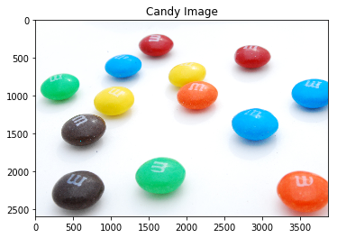

# Color-Segmentation-using-Python-Opencv
This is a color segmentation code implemented using Python and OpenCV library.

## Description:
  This program implements color segmentation technique to separate candies according to their color spaces and count the number of candies of each color.
  

  

## Program flow:
  - Conver image into HSV color space.
  - Find lower and upper values for each color. <b>It can be found using this [code](https://github.com/srane96/HSV-Color-Range-Calculator)</b>
  - Using these lower and upper values create a binary mask.
  - Apply contour detection on this mask and set lower limit on the area of the contours to only count the large areas associated with the candies.
  - Draw the contours and print the count.
  
## Installation:
To run this program, you need to have a jupyter notebook installed in your system. Follow this <b>[link](https://jakevdp.github.io/blog/2017/12/05/installing-python-packages-from-jupyter/)</b> to install jupyter notebook.
